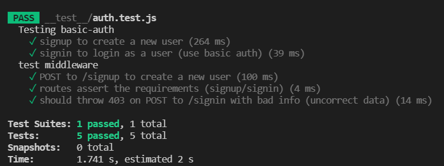

basic-auth

**Author: Khalid hamedi**

**Links and Resources:**

[Heroku](https://khalidsy-basic-auth.herokuapp.com/)
[Github Actions](https://github.com/khalidsy90/basic-auth/actions)
[pull request]()

**Setup**

---

**.env requirements :**

- PORT=3030
- DATABASE_URL=postgres://localhost:5432/basicauth

  ***

**Dependencies needs to install**

    * npm init -y
    * npm i dotenv express cors
    * npm i -D jest supertest
    * npm i sequelize
    * npm i sqlite3
    * npm i pg

---

**To Run the Application :**

- clone the repository
- run the command (npm run dev)

---

**Testing**

---

**UML/Application**

